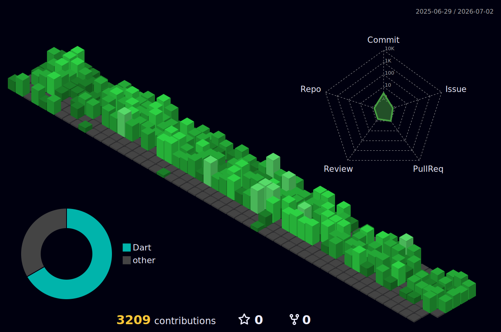

<!-- GitHub Profile README for Manuel36791 -->

<!-- Header Banner -->

  

<!-- Introduction Section -->
<h1 align="center">
   
  
</h1>

Results-driven Flutter Developer passionate about building high-performance, cross-platform mobile applications that deliver real value to users and businesses alike.

Location: Cairo, Egypt · Experience: 2+ years in Dart and Flutter · Learning: NestJS

<!-- Contact Section -->
<h3 align="left">Connect with me:</h3>

   

<!-- Skills Section -->
## Stack

**Languages**

**Frontend**

**Backend & Databases**

**Tools & IDEs**

<!-- Project Showcase Table -->
## Apps & Projects

*Real-world apps and side projects.*

<table>
<tr>

<td width="50%" valign="top">

### SPA ERP+

ERP+ All-in-One is your complete mobile ERP solution. Manage HR, CRM, Projects, Accounting, and more — all from one powerful app.

</td>

<td width="50%" valign="top">

### Whistle Blowing

In a world where speaking up can be difficult, your voice deserves to be heard—safely and anonymously.

</td>

</tr>

<tr>

<td width="50%" valign="top">

### MyCity Services

MyCity is your all-in-one platform to connect with trusted local service providers quickly and easily. From home maintenance to personal care, MyCity helps you find professionals ready to serve you — all in one place.

</td>

<td width="50%" valign="top">

### Click Flex

A modern mobile experience focused on performance and usability.

</td>

</tr>

<tr>

<td width="50%" valign="top">

### Dixy’s Toys

E-commerce mobile app for browsing and purchasing toys seamlessly.

</td>

<td width="50%" valign="top">

### Tawazaf

A recruitment and job marketplace platform connecting talent with opportunities.

</td>

</tr>

<tr>

<td width="50%" valign="top">

### Prime - Car Rental

Car rental mobile solution with smooth booking and management features.

</td>

<td width="50%" valign="top">

### 1More

Fitness and workout tracking application designed to push limits.

</td>

</tr>

<tr>

<td width="50%" valign="top">

### Marsa

Travel and booking experience with a focus on simplicity and speed.

</td>

<td width="50%" valign="top">

</td>

</tr>

</table>

<!-- Project Info Badges -->
<h2>ℹ️ Project info</h2>

  
  
  
  

<!-- Snake Animation -->

  

<!-- 3D Contributions -->

  

<!-- GitHub Stats -->
<h2>📊 GitHub Stats</h2>

  
  
  
  

