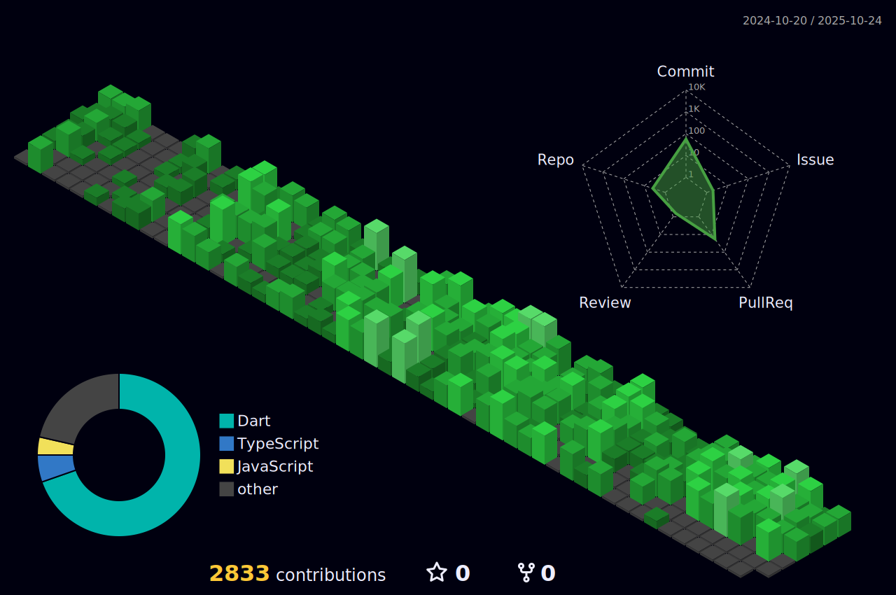

<!-- GitHub Profile README for Manuel36791 -->

<!-- Header Banner -->

  

<!-- Introduction Section -->
<h1 align="center">
  Hi 
   
  
</h1>

  

<!-- Contact Section -->
<h3 align="left">Connect with me:</h3>

  
  

<!-- Skills Section -->
<h2 align="left">Languages - Frameworks - Tools</h2>

  

<!-- Project Info Badges -->
<h2>ℹ️ Project info</h2>

  
  
  
  

<!-- Snake Animation -->

  

<!-- 3D Contributions -->

  

<!-- Project Showcase Table -->
<h2>📱 Samples from my projects</h2>

 | Project Image                                                                                                                                                 | Project Name | Google Play | App Store |
|---------------------------------------------------------------------------------------------------------------------------------------------------------------|--------------|-------------|-----------|
|        | **Click Flex** |  |  |
|             | **Dixy's Toys** |  |  |
|              | **Tawazaf** |  |  |
|              | **Sawaeid** |  |  |
|                      | **HGE** |  |  |
|  | **Magical Spray** |  |  | 
|              | **Karbala** |  |  | 
|                  | **Prime - Car Rental** |  |  |
|                  | **1More** |  |  | 
|                | **Raghwa** |  |  |
|                  | **Marsa** |  |  |

<!-- GitHub Stats -->
<h2>📊 GitHub Stats</h2>

  
  
  
  

