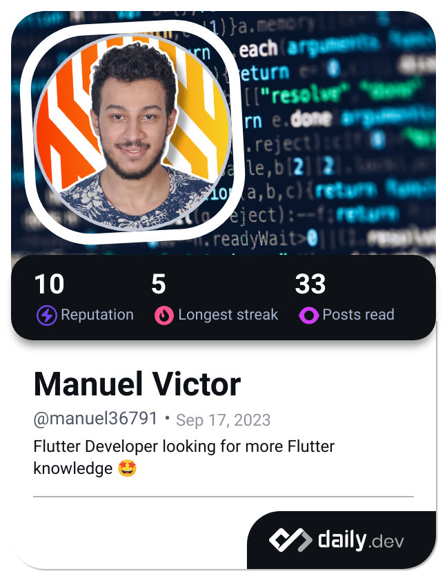

<h1 align="center">Hi  

    

<!-- - Software Engineer
- Flutter Developer
- More than 1 project -->

<h3 align="left">Connect with me:</h3>

<h2 align="left">Languages-Frameworks-Tools</h2>
 

  <a href="https://skillicons.dev">
     
  </a>

 

<h2>ℹ️ Project info</h2>

<h2> Samples from my projects </h2>

### Click Flex

<!--  -->

<!-- 
 
 -->

 

  

  

 
&nbsp;

